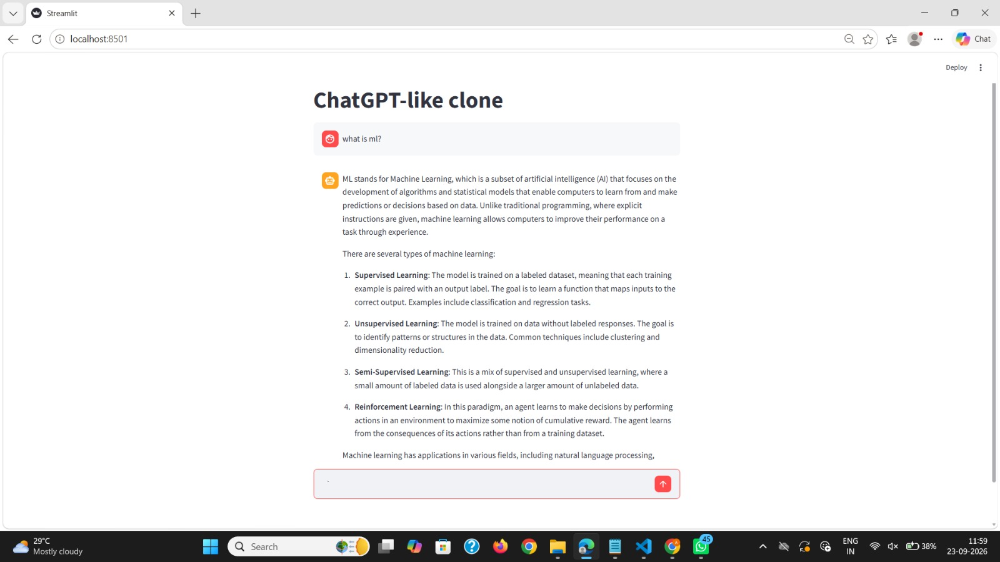

# 🤖 OpenAI Chatbot – Streamlit

An interactive ChatGPT-like web application built with **Python, Streamlit, and the OpenAI API**, providing real-time AI-generated responses through a clean conversational interface with streamed output and session-based chat history.

---

## 🚀 Project Overview / Description

### What the project does

The **OpenAI Chatbot** is an interactive conversational AI web application developed using **Streamlit** and the **OpenAI API**. It allows users to enter natural-language questions and receive AI-generated responses through a ChatGPT-like interface.

The application maintains the conversation during the current session and streams the assistant's response progressively, creating a more interactive and responsive user experience.

### The problem it solves

Traditional command-line AI applications provide limited interaction and do not offer a user-friendly conversational interface. This project addresses that limitation by providing a browser-based chatbot with a simple and intuitive chat interface.

The application allows users to interact with an OpenAI language model in a conversational format while maintaining previous messages as context throughout the active session.

### Primary use case

The chatbot can be used as:

* An educational conversational AI application
* A personal AI assistant
* A demonstration of OpenAI API integration
* A foundation for building advanced AI applications
* A portfolio project demonstrating Generative AI and Python development

---

## ✨ Key Features

### 💬 Interactive Chat Interface

Provides a ChatGPT-like conversational interface using Streamlit's built-in chat components, allowing users to send questions and view responses in an organized conversation format.

### 🤖 OpenAI API Integration

Integrates the OpenAI API to generate intelligent responses using a configured OpenAI language model.

### ⚡ Real-Time Streaming Responses

The application uses OpenAI's streaming functionality to display generated responses progressively instead of waiting for the complete response.

This creates a more responsive and interactive user experience.

### 🧠 Conversation History

User and assistant messages are stored in Streamlit session state, allowing previous messages to remain visible and available as conversational context during the active session.

### 🔐 Secure API Key Management

The OpenAI API key is loaded from a `.env` file using `python-dotenv` instead of being directly embedded inside the source code.

The `.env` file is excluded from Git using `.gitignore`.

### 🎨 Simple and Clean UI

The application uses Streamlit's native chat components to provide a clean browser-based conversational interface without requiring a separate frontend framework.

---

## 📸 Application Preview

Here is a look at the interactive OpenAI chatbot interface and streamed AI response:



(Note: Ensure your screenshot image file is placed inside an assets/ folder in your project directory, or update the path above to match where your image is saved).

---

## 🛠 Tech Stack & Dependencies

* **Programming Language:** Python
* **Web Framework / UI:** Streamlit
* **Generative AI API:** OpenAI API
* **Python OpenAI SDK:** OpenAI
* **Environment Variable Management:** python-dotenv
* **Frontend:** Streamlit Chat Components
* **Development Environment:** Python Virtual Environment

### Main Python Packages

```text
openai
streamlit
python-dotenv
```

---

## 📂 Project Structure

```text
OPENAI_CHATBOT/
│
├── assets/
│   └── chatbot_screenshot.png     # Application screenshot
│
├── chatbot_OpenAI.py              # Main Streamlit chatbot application
├── requirements.txt               # Python dependencies
├── .gitignore                     # Files excluded from Git
├── .env                           # API key configuration (not uploaded)
├── venv/                          # Python virtual environment (not uploaded)
└── README.md                      # Project documentation
```

### Important Files

| File                | Description                                                             |
| ------------------- | ----------------------------------------------------------------------- |
| `chatbot_OpenAI.py` | Main application containing the Streamlit UI and OpenAI API integration |
| `requirements.txt`  | Contains the required Python packages                                   |
| `.env`              | Stores the OpenAI API key locally                                       |
| `.gitignore`        | Prevents sensitive and unnecessary files from being uploaded            |
| `README.md`         | Project documentation                                                   |
| `assets/`           | Contains project screenshots and visual assets                          |

---

## 📥 Installation & Setup Guide

### Step 1: Clone the repository

Clone the project repository to your local machine using Git:

```bash
git clone <your-repository-url>
cd OPENAI_CHATBOT
```

---

### Step 2: Set up a virtual environment

Create a Python virtual environment to manage the project dependencies locally.

#### On macOS and Linux

```bash
python3 -m venv venv
source venv/bin/activate
```

#### On Windows

```powershell
python -m venv venv
```

Activate the environment:

```powershell
.\venv\Scripts\Activate.ps1
```

If the Python Launcher is used on Windows:

```powershell
py -m venv venv
```

---

### Step 3: Install dependencies

Install all required packages using:

```bash
pip install -r requirements.txt
```

---

### Step 4: Configure the OpenAI API Key

Create a `.env` file in the root project directory:

```env
OPENAI_API_KEY=your_openai_api_key
```

The application loads the API key using:

```python
load_dotenv()

OPENAI_API_KEY = os.getenv("OPENAI_API_KEY")
```

> ⚠️ **Security Note:** Never upload your `.env` file or expose your OpenAI API key on GitHub.

Make sure `.env` is included in `.gitignore`.

---

## ▶️ How to Run / Usage

Follow these steps to launch and test the application locally.

### Step 1: Navigate to the project directory

Open your terminal and navigate to the project folder:

```bash
cd OPENAI_CHATBOT
```

---

### Step 2: Activate the virtual environment

On Windows:

```powershell
.\venv\Scripts\Activate.ps1
```

---

### Step 3: Launch the Streamlit application

Run:

```bash
python -m streamlit run chatbot_OpenAI.py
```

Alternatively:

```bash
streamlit run chatbot_OpenAI.py
```

---

### Step 4: Access the application

After launching Streamlit, the application will normally be available at:

```text
http://localhost:8501
```

Open the displayed address in your web browser.

---

### Step 5: Interact with the chatbot

Enter a question in the chat input field:

```text
What is artificial intelligence?
```

The application sends the conversation to the configured OpenAI model and displays the generated response progressively using streaming.

---

## 🔄 Application Workflow

The chatbot follows the workflow below:

```text
User enters a question
          ↓
Streamlit Chat Input
          ↓
Store user message
          ↓
Build conversation history
          ↓
Send messages to OpenAI API
          ↓
Stream response from OpenAI
          ↓
Display response progressively
          ↓
Store assistant response
          ↓
Continue conversation
```

### Conversation Flow

The application stores messages in Streamlit's session state:

```python
st.session_state.messages
```

Each message contains:

```python
{
    "role": "user",
    "content": "User question"
}
```

or:

```python
{
    "role": "assistant",
    "content": "AI response"
}
```

The complete conversation history is then supplied to the OpenAI model for subsequent responses.

---

## 🧠 OpenAI Integration

The application initializes the OpenAI client using the API key stored in the environment:

```python
client = OpenAI(api_key=OPENAI_API_KEY)
```

The chatbot sends the conversation to the configured model:

```python
stream = client.chat.completions.create(
    model=st.session_state["openai_model"],
    messages=[
        {
            "role": m["role"],
            "content": m["content"]
        }
        for m in st.session_state.messages
    ],
    stream=True,
)
```

The response is displayed using Streamlit's streaming functionality:

```python
response = st.write_stream(stream)
```

This allows the response to appear progressively in the interface.

---

## 📊 Conversation Management

The application uses Streamlit session state to maintain the current conversation.

### Message History

```python
if "messages" not in st.session_state:
    st.session_state.messages = []
```

Every user message is stored:

```python
st.session_state.messages.append(
    {
        "role": "user",
        "content": prompt
    }
)
```

The assistant's response is also stored:

```python
st.session_state.messages.append(
    {
        "role": "assistant",
        "content": response
    }
)
```

This enables the chatbot to maintain conversational context during the active Streamlit session.

---

## 🔐 Security & API Key Management

The project uses environment variables to protect the OpenAI API key.

### `.env`

```env
OPENAI_API_KEY=your_openai_api_key
```

### `.gitignore`

The `.env` file should never be committed to GitHub.

Example:

```gitignore
.env
venv/
.venv/
__pycache__/
*.pyc
.streamlit/secrets.toml
```

### Important Security Practices

* Never hard-code the API key inside Python source code.
* Never commit `.env` to GitHub.
* Never share the API key publicly.
* If an API key is accidentally exposed, revoke it and generate a new one.
* Use environment variables or deployment secrets when deploying the application.

---

## 🔮 Future Enhancements

The current chatbot provides the foundation for a more advanced Generative AI application.

Planned enhancements include:

* 💾 Persistent chat history
* 🗂️ Multiple conversation management
* 🏷️ Automatic chat title generation
* 🗑️ Delete individual conversations
* 📄 PDF document upload
* 🔍 Retrieval-Augmented Generation (RAG)
* 🧠 ChromaDB vector database integration
* 📚 Document source citations
* 🔎 Semantic document search
* 🎨 Advanced ChatGPT-style UI
* 🌐 Deployment using Streamlit Community Cloud
* ⚙️ Model selection
* 📊 Token usage tracking
* 📝 Markdown and code formatting improvements

---

## ⚖️ License

This project is developed for **educational, learning, and professional portfolio purposes**.

---

## 👤 Author / Acknowledgments

Made with ❤️ by **Aarya Musale**

This project was developed as part of learning and exploring **Generative AI, OpenAI API integration, Python, and Streamlit application development**.
